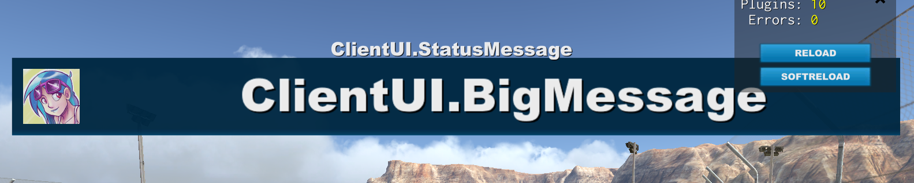

# Maniascript things

Some notes about Maniascript that are helpful to remember.

## Script lifetime

Scripts stay in memory until they stop. This means that this script will disappear from memory immediately after running:

	main()
	{
		log("Hello world");
	}

But this script will keep running:

	main()
	{
		while (True) {
			yield;
		}
	}

If you send scripts with the same ID right after each other, it is undefined behavior. If you send 100 scripts slow, it might execute a few in the middle, but it will most definitely execute the last script. If you send each script you want to execute with a different ID (eg. "RunScrip1", "RunScript2", ...) it will execute all of them. So don't send a lot of scripts that stay in memory for a long time, or you'll leak memory.

## ClientUI

ClientUI is the UI which we can set on the client-side.

### Status/big message

	ClientUI.StatusMessage = "ClientUI.StatusMessage";
	ClientUI.BigMessage = "ClientUI.BigMessage";
	ClientUI.BigMessageAvatarLogin = "ansjh";

	ClientUI.StatusMessage = "ClientUI.StatusMessage";
	ClientUI.BigMessage = "ClientUI.BigMessage";
	ClientUI.BigMessageAvatarLogin = "";
